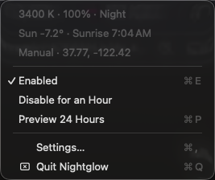

# Nightglow

[nightglow.io](https://nightglow.io) · MIT licensed · macOS 13+



A macOS menu bar clone of [f.lux](https://justgetflux.com/): it warms the colour
temperature of every display, and can dim them, following the sun at your location.

- **Sun-driven:** NOAA solar-position equations give the sun's elevation for your
  coordinates. Full daytime settings above +3°, full night below −6° (end of civil
  twilight), a linear blend in between, as [Redshift](https://github.com/jonls/redshift) does.
- **Location without a prompt:** manual coordinates, else a Location Services fix
  (cached), else the reference city of your time zone from `/usr/share/zoneinfo/zone.tab`.
- **All displays, calibration kept:** each display's ColorSync gamma table is scaled per
  channel with `CGSetDisplayTransferByTable`, so external monitors work without DDC and
  your calibration survives. Tables are re-read on display changes and wake, reapplied
  every 30 s, and macOS drops them when the process exits, so a crash can't leave the
  screen orange.
- **Menu:** current K / brightness / phase, sun elevation and next sunrise or sunset,
  Enabled, Disable for an Hour, Preview 24 Hours (a 12-second sweep), Settings, Quit.
- **Settings:** day/night temperature (with Candle, Tungsten, Halogen, Fluorescent,
  Daylight presets), day/night brightness, location source, launch at login.

## Install

Download `Nightglow.zip` from the [latest release](https://github.com/micahstubbs/nightglow/releases/latest),
unzip it and move `Nightglow.app` to `/Applications` or `~/Applications`.

The build is ad-hoc signed, not notarized, so macOS blocks the first launch. Open it once, then go to
**System Settings → Privacy & Security** and click **Open Anyway**. Or clear the quarantine flag:

```bash
xattr -dr com.apple.quarantine /Applications/Nightglow.app
```

Building from source (below) avoids this.

## Build and install from source

Requires Xcode (for XCTest) or the Swift 5.9+ toolchain.


```bash
yarn test          # 23 XCTest cases for the core (solar, colour, schedule, gamma, location)
yarn install-app   # release universal build -> ~/Applications/Nightglow.app, then launch
scripts/verify-live.sh   # drives the running app's menu and checks the live gamma tables
```

## CLI

```bash
Nightglow --status              # location, sun elevation, sunrise/sunset, target setting
Nightglow --gamma               # live gamma table tops per display (1 1 1 = untinted)
Nightglow --probe 2700 0.7      # apply for 2 s, read back, restore; PASS/FAIL
```

The binary is `~/Applications/Nightglow.app/Contents/MacOS/Nightglow` (or `swift run Nightglow`).

## Layout

- `Sources/NightglowCore` – pure, tested logic: `Solar`, `ColorTemperature`, `Schedule`,
  `GammaRamp`, `TimeZoneLocation`, `SettingsStore`.
- `Sources/Nightglow` – AppKit/SwiftUI app: `GammaEngine`, `Controller`, `StatusMenu`,
  `SettingsView`, `LocationProvider`, `CLI`.
- `scripts/build-app.sh` – bundles, ad-hoc signs and optionally installs the `.app`.

## Notes

Brightness is software dimming through the gamma table, like f.lux. Hardware backlight
control of external monitors over DDC/CI, as in
[MonitorControl](https://github.com/MonitorControl/MonitorControl), is a possible
follow-up. Night Shift works independently; turn it off to avoid double warming.

## Contributing

Issues and pull requests are welcome. Run `yarn test` before sending changes that touch
`Sources/NightglowCore`; UI changes should be checked with `scripts/verify-live.sh` against an
installed build. Work is tracked with [beads](https://github.com/Dicklesworthstone/beads_rust) in `.beads/`.

## License

[MIT](LICENSE)
